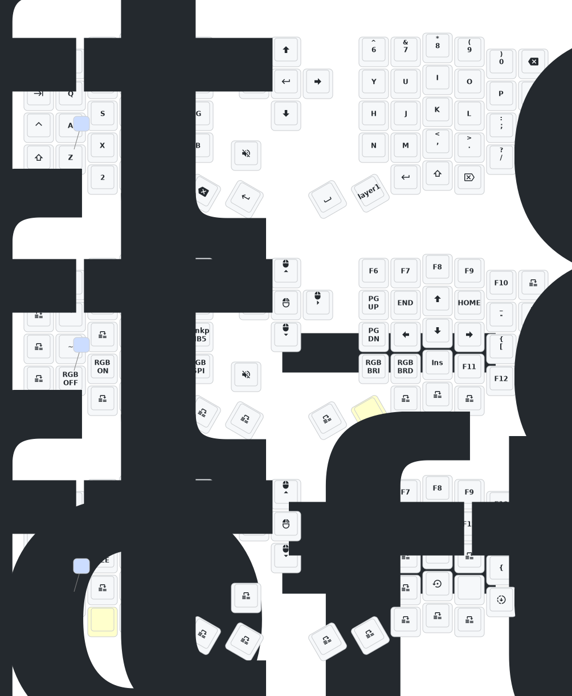

# Update List

## Changelog

- 2024/12/21
  1. Added zmk-studio support (just refresh the left half to use).
- 2024/10/24
  1. Changed power mode — reduced power consumption.  
  2. Fixed automatic RGB power-off feature.
- 2025/03/30
  - Added 1-hour sleep entry time.  
  - Increased debounce time.  
  - Optimized post-sleep power consumption.
- 2025/08/22
  1. Updated soft off: press and hold Q + S + Z for 2 seconds to enter deep sleep; keyboard cannot be woken by keys while in this state — useful when carrying the keyboard. Reactivate by pressing the reset switch once.  
  2. Updated low-profile Sofle and Corne cases this month: thicker frame and bottom plate, adjusted reset-switch opening so the reset switch is easy to press. Still designing a version with a tilted stand. Note: the PCB has reserved headers for expanded I/O — will test usage.  
  3. Removed GIF animation on the right-half keyboard screen to significantly reduce right-half power consumption.

> If your keyboard was updated before 2025/08/22, please update to the latest firmware.

# Contact Me

For 3D printed model files or any issues and malfunctions with the keyboard, please contact 380465425@qq.com

# Sofle Keymap

